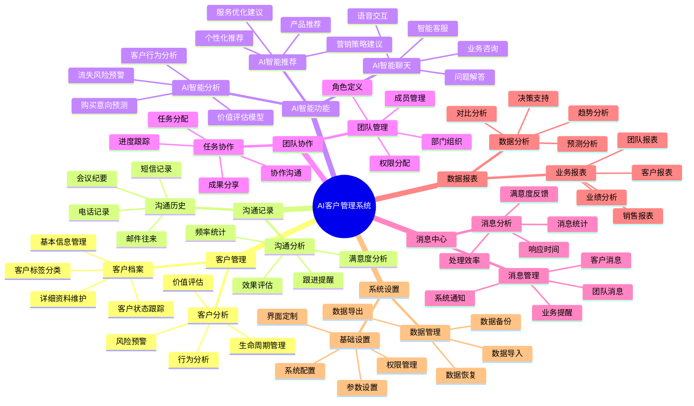

# AI客户管理系统 - 功能介绍导图

## 功能模块详细说明

### 🎯 核心功能模块

#### 1. **客户管理**
- **客户档案管理**: 完整的客户信息录入、编辑、查询
- **客户分类标签**: 多维度客户标签体系，便于精准管理
- **客户状态跟踪**: 实时跟踪客户状态变化，及时响应

#### 2. **沟通记录**
- **全方位记录**: 电话、邮件、会议、短信等所有沟通方式
- **智能分析**: 沟通频率、效果评估、满意度分析
- **自动提醒**: 基于沟通记录的智能跟进提醒

#### 3. **AI智能功能**
- **AI智能分析**: 基于大数据的客户行为分析和预测
- **AI智能推荐**: 个性化营销策略和产品推荐
- **AI智能聊天**: 24/7智能客服，支持语音交互

#### 4. **团队协作**
- **团队管理**: 灵活的成员管理和权限分配
- **任务协作**: 高效的任务分配和进度跟踪
- **实时沟通**: 团队内部即时消息和协作

#### 5. **消息中心**
- **统一消息**: 系统通知、业务提醒、团队消息统一管理
- **消息分析**: 消息处理效率和响应时间统计
- **智能推送**: 基于业务逻辑的智能消息推送

#### 6. **数据报表**
- **多维度报表**: 销售、客户、团队、业绩等多角度分析
- **可视化展示**: 图表化数据展示，直观易懂
- **决策支持**: 基于数据的业务决策建议

#### 7. **系统设置**
- **灵活配置**: 系统参数、界面、权限等全方位配置
- **数据安全**: 完善的数据备份、恢复、导入导出功能
- **扩展性**: 支持功能模块的灵活扩展和定制

### 🚀 技术特色

#### **前端技术**
- **现代化UI**: Bootstrap 5 + 自定义CSS，响应式设计
- **交互体验**: JavaScript + 动画效果，流畅的用户体验
- **语音功能**: Web Speech API，支持语音输入输出

#### **后端技术**
- **Spring Boot**: 现代化的Java开发框架
- **MyBatis**: 灵活的ORM框架，高效的数据访问
- **H2数据库**: 轻量级数据库，快速部署和测试

#### **AI集成**
- **智能分析**: 基于机器学习的客户行为分析
- **自然语言处理**: 智能聊天和文本分析
- **预测模型**: 客户价值预测和流失预警

### 📊 业务价值

#### **提升效率**
- **自动化流程**: 减少手工操作，提高工作效率
- **智能提醒**: 及时的业务提醒，避免遗漏重要事项
- **快速查询**: 高效的客户信息查询和检索

#### **增强体验**
- **个性化服务**: 基于AI的个性化推荐和服务
- **多渠道沟通**: 统一的沟通记录和管理
- **实时响应**: 24/7智能客服，快速响应客户需求

#### **数据驱动**
- **精准分析**: 基于数据的客户分析和业务洞察
- **科学决策**: 数据驱动的业务决策支持
- **持续优化**: 基于反馈的持续改进和优化

### 🎯 适用场景

#### **企业客户管理**
- 中小企业客户关系管理
- 销售团队协作和管理
- 客户服务和支持

#### **行业应用**
- 制造业客户管理
- 服务业客户关系
- 电商客户运营
- 金融客户服务

#### **团队规模**
- 小型团队（5-20人）
- 中型团队（20-100人）
- 大型团队（100+人）

---

**AI客户管理系统 - 智能化客户关系管理，助力企业数字化转型！** 🚀
